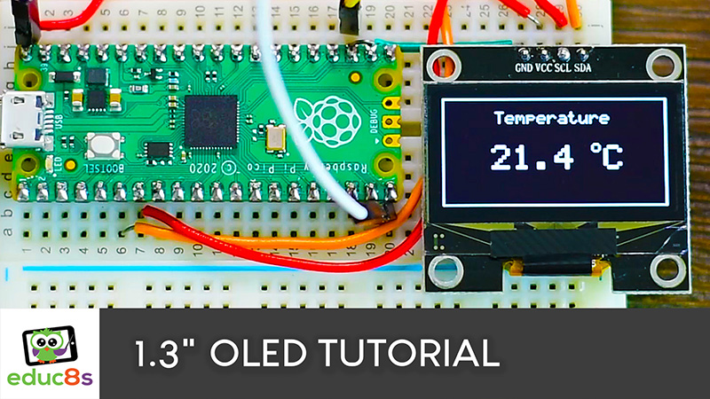

# Arduino 1.3" OLED SSH1106 Examples.

4 Examples to help you get started with Arduino and the 1.3" OLED with the SSH1106 driver.

Example 1: A Hello World program that displays a text on the screen and a frame.

Example 2: A program that displays the temperature in English.

Example 3: A program the displays the temperature in Greek, using the drawBitmap function to load the UI as a bitmap.

Example 4: A Pong game where the microcontroller controlls both paddles.

# Video Tutorial

  

🎥 <a href="https://youtu.be/aPYCJmTf_fc">Video Tutorial on YouTube</a>

 
 

| 📺 <a href="https://www.youtube.com/educ8s">YouTube</a>
| 🌍 <a href="http://www.educ8s.tv">Website</a> |  

# Parts Needed
🛒 Display ▶ https://educ8s.tv/part/OLED13

🛒 Raspberry Pi Pico ▶ http://educ8s.tv/part/RaspberryPiPico

🛒 DHT22 Sensor: https://educ8s.tv/part/DHT22

💖 Full disclosure: All of the links above are affiliate links. I get a small percentage of each sale they generate. Thank you for your support!

